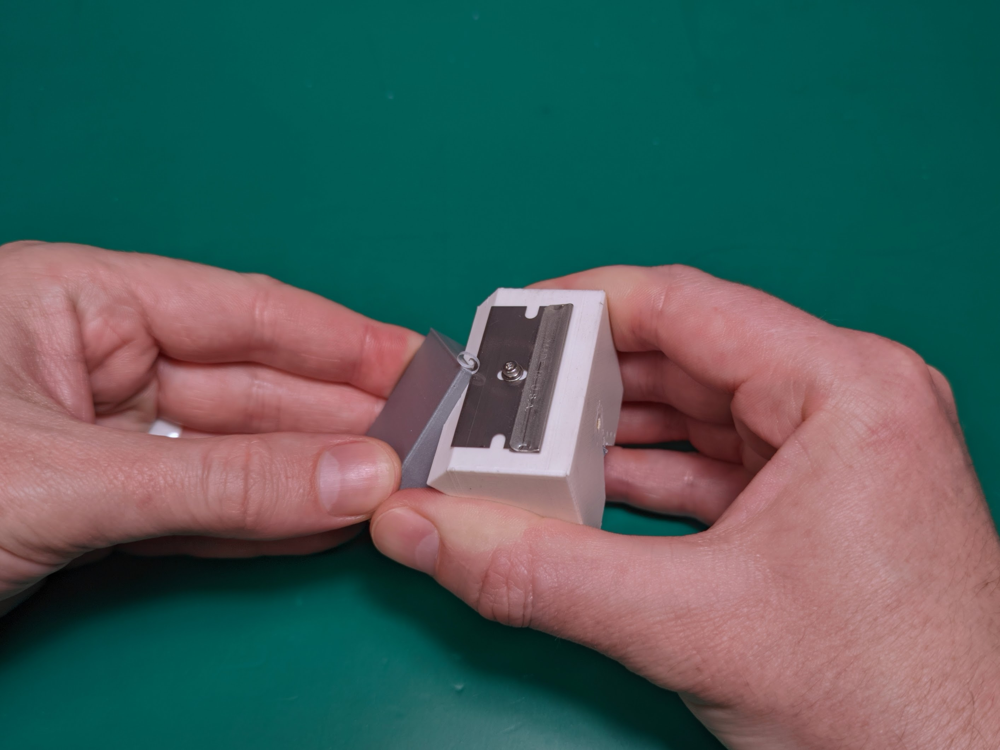
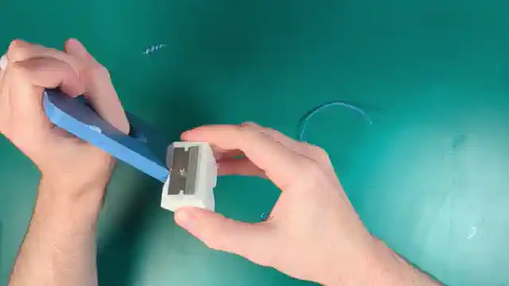
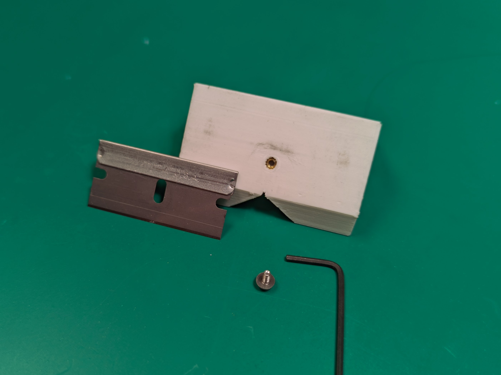

# Razor chamfer block
3dprinted model to help out when removing brims from parts.

This is a quick OpenScad model for more consistent deflashing/chamfering of other printed parts. 

This is designed to use an m2 heat set insert that fits a 3mm wide x 5mm deep hole.

The Razor can be mounted to two sides but I have found the bull-nose side to be most useful.

